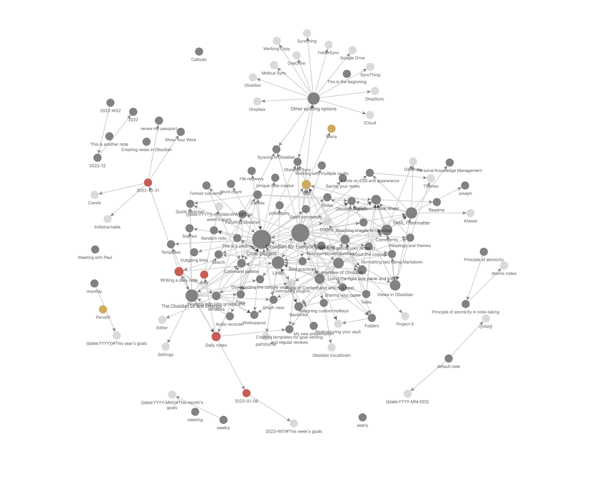

## The Problem To Be Solved:

::: incremental
**PB3 produces many datasets** — soils, crops, models, images, field measurements

- Where is this data stored? Who is responsible? What is the structure?
- Not all data needs to be published but it may still be useful for the group in the future.
- When a colleague leaves, how do we find their data?
:::

::: fragment
> **A shared, structured record of our datasets — maintained like code, readable like a document.**
:::

------------------------------------------------------------------------

## Proposed Approach to Implementation in One Sentence

::: r-fit-text
One structured text file (Markdown) per dataset. Stored together in a shared folder. Managed with version control.
:::

------------------------------------------------------------------------

## What is Markdown?

::::: columns
::: {.column width="50%"}
**A lightweight markup language for creating formatted text:**

- `**bold**` → **bold**
- `# Heading` → a title
- `- item` → a bullet point

Plain text files, readable in any editor, no special software needed.
:::

::: {.column width="50%"}
``` markdown
# Soil Moisture Survey 2024

This dataset contains volumetric
soil moisture measurements from
the Müncheberg field site.

**Responsible:** Dr. Müller
**Format:** CSV
**Licence:** CC-BY-4.0
```
:::
:::::

------------------------------------------------------------------------

## What About the Structured Part?

Each file has a small block of **structured fields at the top** — think of it as a standardised form:

``` yaml
---
title: "Soil Moisture Survey 2024"
date_created: 2024-06-01
applicant: "Mueller, Anna"
status: complete
keywords: [soil, moisture, field experiment]
storage:
  repository: Zenodo
  license: CC-BY-4.0
---
```

::: fragment
This is **YAML** — just labelled fields, like filling in a form. Everything after it is free text you write normally.
:::

------------------------------------------------------------------------

## So a Catalogue Entry Would Look Something Like This

```         
---
title: "Soil Moisture Survey — Müncheberg 2024"
id: "2024-mueller-soil-moisture"
status: complete
applicant: "Mueller, Anna"
keywords: [soil, moisture, field, sensor]
data:
  format: [csv]
  coverage:
    spatial: "Müncheberg research farm"
    temporal: "2024-04 to 2024-09"
storage:
  repository: Zenodo
  license: CC-BY-4.0
---

## Description

Volumetric soil moisture measured at five depths using TDR sensors
across three field plots. Data collected weekly during the growing season.

Used as input for the crop water stress model in [[2024-schmidt-crop-yield]].
```

------------------------------------------------------------------------

## Why This Approach?

::: incremental
- **No special software.** Any text editor works — Notepad, VS Code, RStudio, Obsidian.
- **No database to maintain.** Files are files — they open, they copy, they survive.
- **Version-controlled.** Every change is recorded. Nothing gets lost. Mistakes can be undone.
- **Automation-friendly.** Scripts can check, summarise, and publish the catalogue automatically.
- **FAIR by design.** Findable, Accessible, Interoperable, Reusable — built into the structure.
- **Facilitates formal publication** Preparing metadata in a structured way streamlines publishing in repositories later.
:::

------------------------------------------------------------------------

## Tiers of Complexity Depending on Needs and Resources:

::: callout-important
**You do not need to implement everything at once.** Each tier adds value independently. Start small, expand when ready.
:::

| Tier               | Features                                     | Effort   |
|------------------|----------------------------------|---------------------|
| **1 — Core**       | Template + shared folder + version control   | Low      |
| **2 — Automation** | Validation, auto-index, CI checks            | Medium   |
| **3 — Advanced**   | Visual browsing, AI summaries, web interface | Optional |

------------------------------------------------------------------------

## Tier 1 — Core

**What it involves:**

- A shared Git repository (GitHub or internal GitLab)
- A template file for users to follow when adding a new dataset
- A contributing guide explaining how to fill it in

**What you get immediately:**

- A single place to find all dataset records
- Consistent metadata across the group
- Full history of who added or changed what
- Peer review of entries via pull requests

::: callout-note
Some maintenance for Data Steward: reviewing pull requests, onboarding new contributors, keeping the guide up to date.
:::

------------------------------------------------------------------------

## Tier 2 — Automation and Visualisation

**Built on top of Tier 1 — no extra work for researchers:**

::::: columns
::: {.column width="55%"}
- **Validation:** A script checks that mandatory fields are filled in. Runs automatically when a record is added or edited (i.e., a pull request is opened).
- **Auto-generated index:** A summary table of all entries — title, owner, status, keywords — regenerated whenever changes are merged.
- **Obsidian integration** — Open the folder as a knowledge graph. Browse connections between datasets visually. No configuration needed.
:::

::: {.column width="45%"}
{height="50%"}
:::
:::::

------------------------------------------------------------------------

## Tier 3 — Advanced

**Optional extensions, added when the catalogue matures:**

- **AI knowledge base** — A 'Hot' concept in the last few weeks give a local LLM custom prompts to generate a wiki style summary of the catalogue, users can make natural language queries like "What datasets do we have on soil moisture?" and get a concise answer with links to the relevant entries.
- **Web interface** — A static website built from the Markdown files, searchable and filterable.
- **Web form** — A simple form that generates the YAML and opens a pull request, for those who prefer not to edit files directly.

------------------------------------------------------------------------

## Adding a New Entry — Tier 1 Workflow

:::::: columns
::: {.column width="55%"}
1.  Copy the template file
2.  Rename it: `2025-lastname-topic.md`
3.  Fill in the fields (start with the mandatory ones)
4.  Write a short description below
5.  Submit via pull request
6.  A colleague reviews and merges
:::

:::: {.column width="45%"}
::: callout-tip
**Set `status: draft`** if you're not finished yet. The entry is registered, validation is lenient, and you can complete it later.
:::
::::
::::::

------------------------------------------------------------------------

## Entry Lifecycle

```         
draft  ──>  complete  ──>  archived
```

- **draft** — Started but incomplete. Mandatory fields flagged as warnings.
- **complete** — All mandatory fields filled; data deposited. Full validation applies.
- **archived** — Retained for reference; no longer actively maintained.

------------------------------------------------------------------------

## What Mandatory Actually Means

You decide which fields are truly required for a **complete** entry:

::::: columns
::: {.column width="50%"}
**Identity & People**

- Title, ID, status
- Applicant, project lead, data manager

**Data Description**

- Purpose, collection method, format, type
:::

::: {.column width="50%"}
**Storage & Legal**

- Repository, licence, availability, access restrictions
- Personal data: yes/no
- Data ownership

**Documentation**

- What documentation exists
- Links to scripts, codebooks, repos
:::
:::::

------------------------------------------------------------------------

## Connecting Datasets

Entries can reference each other — useful for tracing data lineage:

::::: columns
::: {.column width="55%"}
**Structured (for automation):**

``` yaml
related_entries:
  - id: "2023-weber-aqua-land-model"
    relationship: "derived-from"
```

**Wiki-style links (for Obsidian graph view):**

``` markdown
This dataset was used as input for [[2023-weber-aqua-land-model]].
```
:::

::: {.column width="45%"}
{height="50%"}
:::
:::::

------------------------------------------------------------------------

## What the Repository Looks Like

```         
PB3-data-catalogue/
├── catalogue/                   ← one file per dataset
│   ├── 2024-mueller-soil-moisture.md
│   └── 2025-schmidt-crop-yield.md
├── templates/
│   └── new-entry.md             ← copy this to add a dataset
├── index.md                     ← auto-generated summary table
├── CONTRIBUTING.md              ← step-by-step guide for researchers
└── README.md
```

------------------------------------------------------------------------

## Suggested Implementation Phases

| Phase | What gets built |
|----------------------|-------------------------------------------------|
| **1. Template & schema** | Agree on fields; create template and validation schema |
| **2. Pilot entries** | 3–5 real datasets to test and refine the template |
| **3. CI validation** | Automated checks on every pull request |
| **4. Contributing guide** | Clear instructions written for researchers |
| **5. Index generation** | Script to produce the summary table |
| **6+. Advanced features** | Obsidian, AI summary, web interface — when ready |

::: callout-note
Phases 1–4 can be completed very quickly and deliver real value on their own.
:::

------------------------------------------------------------------------

## Moving Forward

- **Feedback on the approach** — does this solve the problem? What concerns do you have?
- **Discuss metadata fields** — anything missing? anything unnecessary?
- **Pilot entries** — identify 3–5 datasets to create test entries for, to refine the template and process
- **Decide on scope** — Core only, or start with automation too?

------------------------------------------------------------------------

## Summary

- Plain text files, one per dataset — readable by anyone, editable anywhere
- YAML front matter for structured fields; free text for description
- Stored in Git — full history, peer review, no data loss
- **Tiered:** start with just the template and a shared repo; add automation and advanced features later
- Designed for FAIR compliance from the ground up
- Low barrier to entry for researchers; high payoff for the group

::: fragment
**The catalogue is only as good as the entries in it — but the system makes it as easy as possible to contribute.**
:::